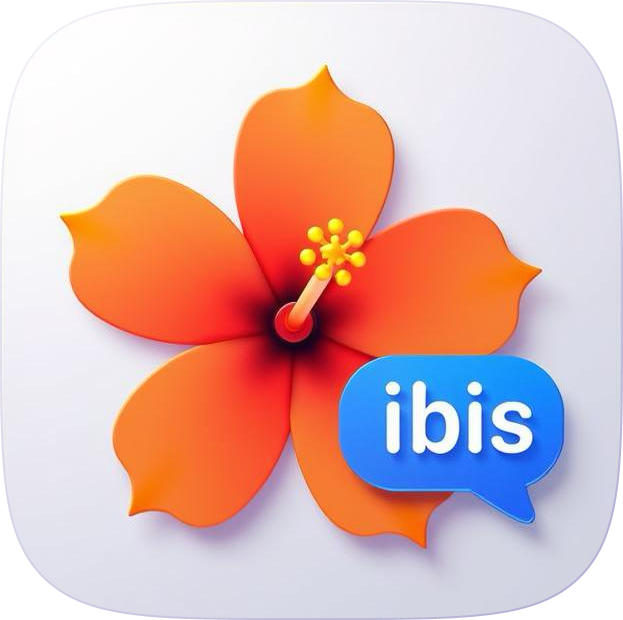

<div align="center">
  <a href="https://chat.hibiscushealth.com">
    
  </a>

  <h3 align="center"><b>HibiscusBot</b></h3>

  <p align="center">
    A personal wellness assistant powered by a sophisticated agentic system.
    <br />
    <a href="https://chat.hibiscushealth.com"><strong>Try it out »</strong></a>
  </p>
</div>

---

## 📖 Overview

HibiscusBot is an intelligent, conversational AI designed to be your personal wellness assistant. It's built on a powerful agentic architecture that uses a supervisor agent to coordinate a team of specialized agents, each an expert in a specific domain like nutrition, fitness, and general wellness.

This modular design allows HibiscusBot to handle a wide range of health-related queries with accuracy and context. The bot also uses Retrieval-Augmented Generation (RAG) to pull in relevant information from a knowledge base, ensuring its responses are not only helpful but also based on a curated set of documents.

## ✨ Features

- **Conversational AI:** Engage in natural, helpful conversations about your health and wellness goals.
- **Agentic Architecture:** A multi-agent system that delegates tasks to specialized agents for more accurate and nuanced responses.
- **Retrieval-Augmented Generation (RAG):** The bot's knowledge is augmented with information from a vector database, allowing it to provide contextually relevant answers.
- **Specialized Agents:**
    - **Nutrition Agent:** Get information and answers to your nutrition-related questions.
    - **Fitness Agent:** Get assistance with fitness-related queries.
    - **General Agent:** For all other wellness topics and general conversation.
- **Extensible:** The modular design makes it easy to add new specialized agents to cover more wellness domains.

## 🚀 Getting Started

Follow these steps to get a local copy of HibiscusBot up and running.

### Prerequisites

- Python 3.9 or higher
- A [GROQ API Key](https://platform.openai.com/account/api-keys)
- A [HUGGING FACE API KEY](https://platform.openai.com/account/api-keys)

### Installation

1.  **Clone the repository:**
    ```sh
    git clone https://github.com/Hibiscus-Health/hibiscus-bot.git
    cd hibiscus-bot
    ```

2.  **Set up a virtual environment:**
    ```sh
    python -m venv venv
    source venv/bin/activate  # On Windows, use `venv\Scripts\activate`
    ```

3.  **Install the dependencies:**
    ```sh
    pip install -r requirements.txt
    ```

4.  **Set up your environment variables:**
    -   Create a file named `.env` in the root of the project.
    -   Add your GROQ API KEY and HUGGING FACE API KEY to the `.env` file:
        ```
        GROQ_API_KEY='your_groq_api_key'
        HF_TOKEN='your_huggingface_token'
        ```

5.  **Ingest the knowledge base (optional):**
    If you want the bot to have access to the documents in the `docs/` directory, you need to run the embedding script. This will process the documents, create embeddings, and store them in the `chroma_db` vector database.
    ```sh
    python -m utils.embeddings
    ```

6.  **Run the application:**
    ```sh
    python utils/embeddings.py

    chainlit run app.py
    ```
    Your application should now be running and accessible at `http://localhost:8000`.

## 📂 Project Structure

The codebase is organized to be clean, modular, and easy to navigate.

```
hibiscus-bot/
├── agents/               # Contains all the specialized agents and the supervisor.
│   ├── __init__.py
│   ├── supervisor_agent.py
│   ├── nutrition_agent.py
│   ├── fitness_agent.py
│   ├── general_agent.py
│   └── state.py          # Defines the shared state for the agentic workflow.
├── chroma_db/            # The vector database for the RAG system.
├── docs/                 # Knowledge base documents for the RAG system.
├── public/               # Static assets for the Chainlit UI.
├── utils/                # Utility modules.
│   ├── __init__.py
│   ├── embeddings.py     # Handles the RAG implementation (chunking, embedding, retrieval).
│   └── prompts.py        # Contains the prompt templates for the agents.
├── .gitignore
├── app.py                # The main entry point for the Chainlit application.
├── chainlit.md           # The introductory content for the Chainlit UI.
├── pyproject.toml
├── readme.md
└── requirements.txt
```

## 🛠️ Technologies Used

-   [Chainlit](https://docs.chainlit.io/): For building the chat interface.
-   [LangChain](https://www.langchain.com/): For building the agentic system and interacting with LLMs.
-   [LangGraph](https://langchain-ai.github.io/langgraph/): For creating the stateful, multi-agent workflow.
-   [OpenAI](https://openai.com/): For the underlying large language models.
-   [ChromaDB](https://www.trychroma.com/): As the vector store for the RAG system.

## 🤝 Contributing

Contributions are what make the open-source community such an amazing place to learn, inspire, and create. Any contributions you make are **greatly appreciated**.

1.  Fork the Project.
2.  Create your Feature Branch (`git checkout -b feature/AmazingFeature`).
3.  Commit your Changes (`git commit -m 'Add some AmazingFeature'`).
4.  Push to the Branch (`git push origin feature/AmazingFeature`).
5.  Open a Pull Request.

## 📄 License

Distributed under the MIT License. See `LICENSE` for more information.